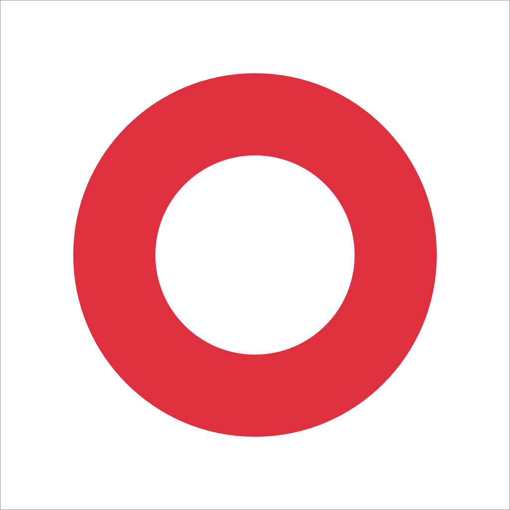
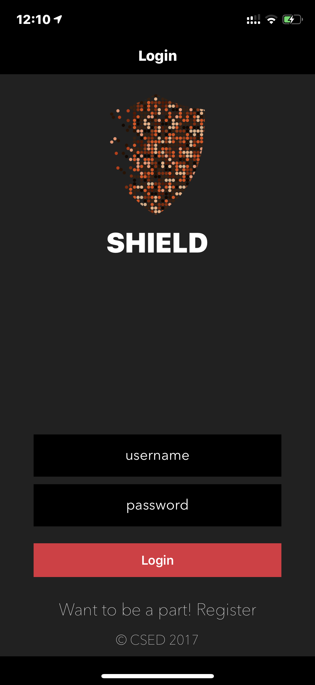
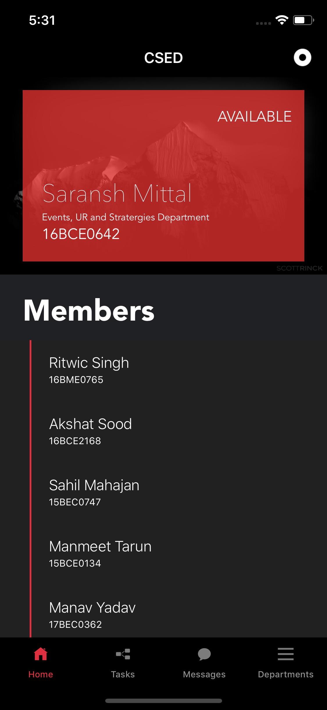
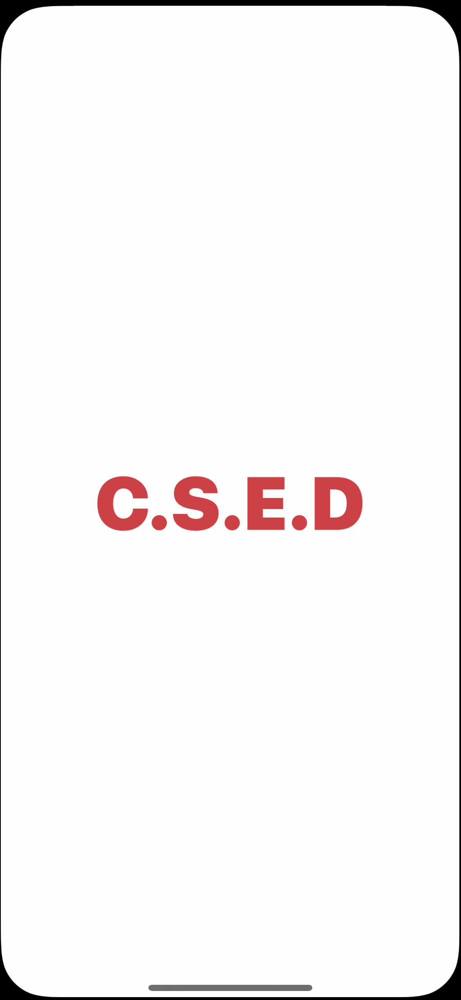
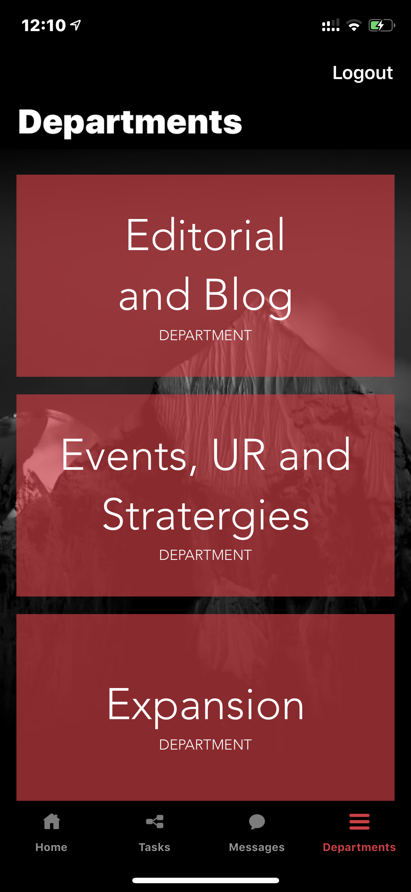
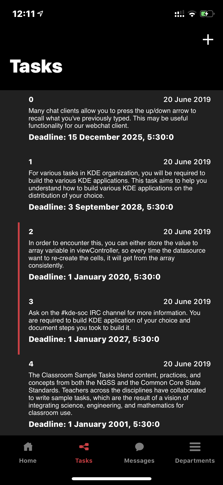

# CSED Internal Application

The repository contains the iOS application I created for SHEILD(CSED) student community at my University for keeping tasks of announcements, assigned tasks to different departments and other chapter daily work. This is the official iOS application for its team to communicate and keep track of the internal work efficiently.

### What is SHIELD?
S.H.E.I.L.D is an organistaion originating from Vellore Institute of Technology. It is a platform for budding entrepreneurs to scale up their startup from ideation stage. We help the young generation of entrepreneurs to understand the ins and outs of the startup world. In addition to this we hold various events and workshops in schools and colleges to help students ideate in an early stage. An important part of its work is to connect entrepreneurs to investors and interns, through our growing network, providing them the required opportunities to grow.

### Application Screenshots

  
  
  
  
  

### Frameworks
<ul>
  <li>Swift 5
  <li>Cocoapods
</ul>

### Cocoapods
<ul>
  <li><a href = "https://cocoapods.org/pods/Firebase">Firebase</a>
  <li><a href = "https://cocoapods.org/pods/eureka">Eureka</a>
</ul>
